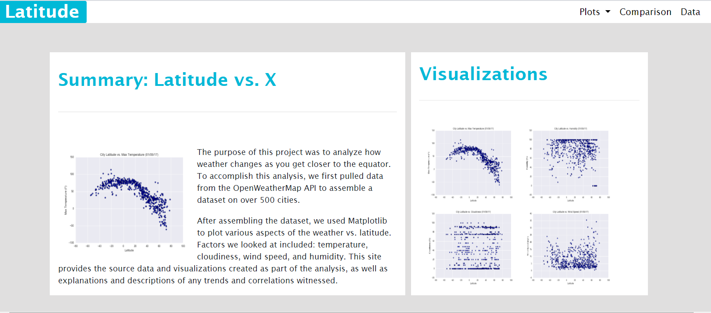
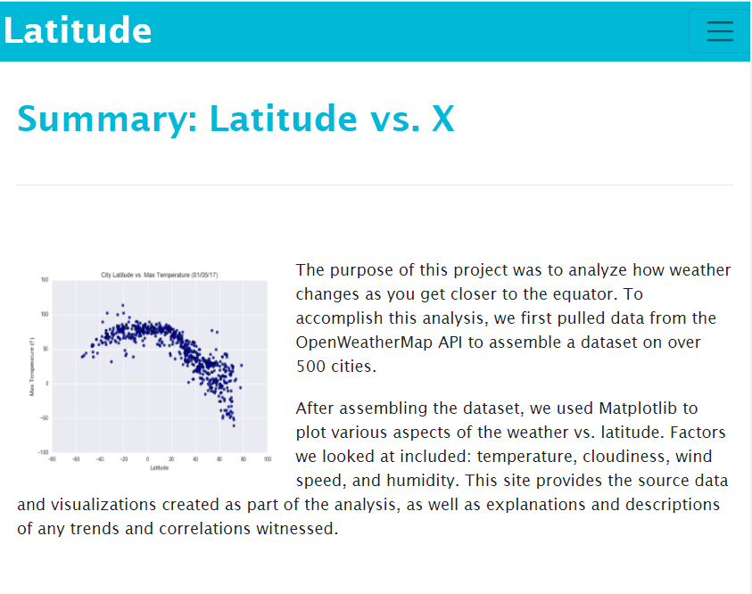
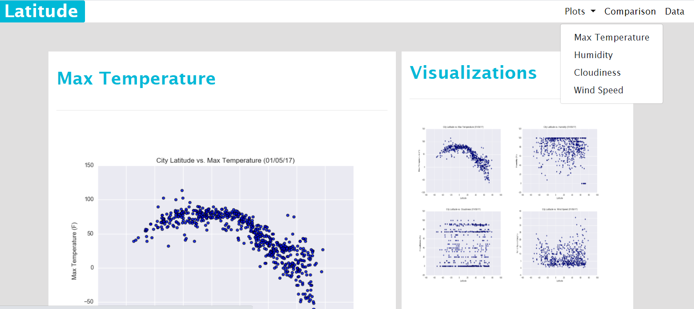
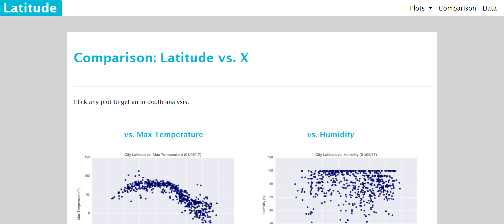

# Web-Design-Challenge
For this challenge, I created 7 html pages and a corresponding css to showcase the results of a previous analysis. This website has the data, visualizations, and the conclusions from my [python-api-challenge](https://github.com/jasoncr/python-api-challenge). 

The first webpage is the landing page for the user. It gives project summary, a side bar with links, and a nav bar at the top. The side bar displays the scatter plots from the four different comparisons between latitude and another variable. Each of the scatter plot images goes to their corresponding webpage that gives some more information about that analysis. 

The nav bar allows the user to go to the same web pages as the side bar, as well as a comparison page and a page that displays the data used from a csv. When building, I considered that this website might be viewed from a mobile device, therefore I made it responsive to a smaller screen. Below I included screen shots of both the landing page viewed from a large screen as well as a small screen. 

As you can see, this website displays the findings in an attractive and intuitive fashion. The user can easily find what they are looking for, therefore they spend less time  hunting for information and more time learning from what the webpage has to offer. I included 2 more screen shots for reference. 

Access the main page by going to:  [https://jasoncr.github.io/Web-Design-Challenge/WebVisualizations/index.html](https://jasoncr.github.io/Web-Design-Challenge/WebVisualizations/index.html)
